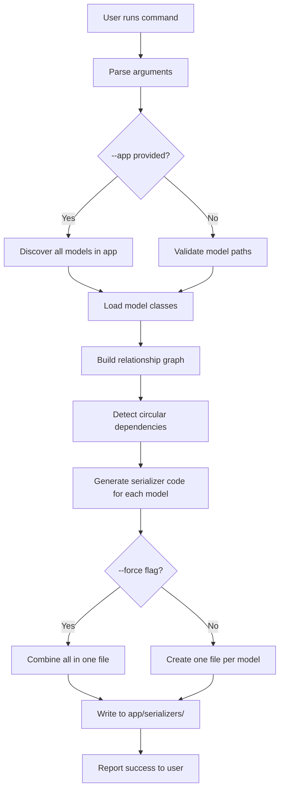
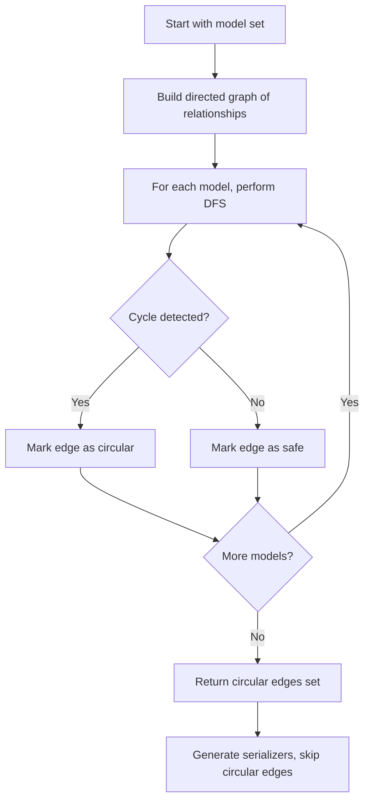

# Plan: Auto-Generate OData Serializers from Django Models

This plan outlines the steps to implement **SPECKIT-008**, which involves creating a Django management command that automatically generates ODataModelSerializer subclasses for Django models with automatic circular dependency detection.

## Overview

Create a Django management command that automatically generates ODataModelSerializer subclasses for Django models. The command will introspect model fields and relationships, detect circular dependencies, and generate complete serializer definitions.

## Architecture Design

### Project Structure

```
django_odata/                          # Main package (where command goes)
├── __init__.py
├── mixins.py
├── native_fields.py
├── serializers.py
├── utils.py
├── viewsets.py
└── management/                        # New management command
    ├── __init__.py
    └── commands/
        ├── __init__.py
        └── generate_odata_serializer.py
        
{app_label}/                           # Target app (e.g., blog, blog_management, etc.)
├── __init__.py
├── apps.py
├── models.py
├── views.py
└── serializers/                       # Generated serializers output
    └── __init__.py
```

**Note**: The command will be part of `django_odata` package, and generated serializers will be placed in each app's `serializers/` directory (specified via `--app` flag).

## Implementation Steps

### 1. Analyze Django Model Introspection APIs

- Study `model._meta.get_fields()` for field discovery
- Understand field types: regular fields vs relationships
- Research property detection using `inspect` module
- Identify how to detect ForeignKey, ManyToManyField, OneToOneField
- Learn how to access reverse relationships

### 2. Design Circular Dependency Detection Algorithm

- Design graph-based cycle detection using DFS
- Create data structure to represent model relationship graph
- Implement algorithm to detect cycles in directed graph
- Design strategy to break cycles (prioritize forward relationships)
- Plan how to report circular dependencies to users

### 3. Create Management Command Structure

- Create `django_odata/management/` directory structure
- Create `commands/generate_odata_serializer.py`
- Implement argument parser for:
  - Positional model paths (e.g., `blog.BlogPost`)
  - `--app` flag for app-wide generation
  - `--force` flag for combining and overwriting
  - `--output` flag for custom output path
- Add command help text and examples

### 4. Implement Model Introspection Module

- Create utility functions to extract model fields
- Implement relationship detection (FK, M2M, O2O, reverse)
- Add property detection for `@property` decorated methods
- Create data classes for field and relationship info
- Handle edge cases (abstract models, proxy models)

### 5. Implement Circular Dependency Detector

- Build relationship graph from model list
- Implement DFS-based cycle detection
- Identify which edges create cycles
- Design algorithm to choose which relationships to skip
- Create clear reporting of detected cycles

### 6. Implement Code Generator

- Design Python code generation templates
- Implement serializer class code generation
- Generate proper import statements
- Create `fields` list generation
- Create `expandable_fields` dict generation
- Add code formatting (proper indentation, line length)
- Validate generated code syntax

### 7. Implement File Management

- Create logic for one-file-per-model output in `{app}/serializers/`
- Create logic for combined file output (--force) in `{app}/serializers/`
- Implement `__init__.py` generation with imports
- Add file overwrite handling (prompt vs --force)
- Ensure proper directory creation

### 8. Add Error Handling and User Feedback

- Validate model path format
- Handle invalid model references
- Report file creation success/failure
- Display circular dependency warnings
- Provide clear error messages for all failure cases

### 9. Create Comprehensive Tests

Unit tests:
- Test model field extraction
- Test relationship detection
- Test circular dependency detection
- Test code generation
- Test import statement generation

Integration tests:
- Test command with single model
- Test command with multiple models
- Test `--app` flag
- Test `--force` flag
- Test error handling
- Verify generated code works

### 10. Document the Feature

- Add command usage to README
- Create examples showing different use cases
- Document the circular dependency detection strategy
- Add troubleshooting guide

## Command Usage Examples

```bash
# Generate serializer for a specific model in blog app
python manage.py generate_odata_serializer blog.BlogPost
# Output: blog/serializers/blog_post.py

# Generate serializers for multiple models
python manage.py generate_odata_serializer blog.BlogPost blog.Author
# Output: blog/serializers/blog_post.py, blog/serializers/author.py

# Generate serializers for all models in an app
python manage.py generate_odata_serializer --app blog
# Output: blog/serializers/blog_post.py, blog/serializers/author.py, etc.

# Generate for multiple apps
python manage.py generate_odata_serializer --app blog --app auth

# Combine all serializers into one file
python manage.py generate_odata_serializer --app blog --force
# Output: blog/serializers/generated.py

# Specify custom output directory
python manage.py generate_odata_serializer blog.BlogPost --output custom/path
# Output: custom/path/blog_post.py
```

## Implementation Flow



## Circular Dependency Detection Algorithm



## Success Criteria

✅ Command successfully generates serializers for any Django model
✅ All model fields are included in the `fields` list
✅ All relationships are detected and added to `expandable_fields`
✅ Circular dependencies are correctly detected and skipped
✅ Generated code is syntactically valid Python
✅ `--app` flag discovers all models in specified app
✅ `--single` flag combines serializers into single file
✅ Serializers generated in `{app}/serializers/` directory
✅ Clear error messages for invalid inputs
✅ Comprehensive test coverage (>90%)
✅ Full app names (e.g., `example.blog`) correctly resolved to app_label for model lookups
✅ Nested `$expand` operations work correctly (e.g., `$expand=author($expand=user)`)
✅ All related models discovered automatically in `--single` mode
✅ Serializer paths use full app names to avoid model conflicts

## Implementation Status

### ✅ Completed Features

1. **Model Introspection** (`django_odata/introspection.py`)
   - Extracts all fields, relationships, and properties from Django models
   - Uses full app config names (`example.blog`) instead of just app_label (`blog`)
   - Handles forward and reverse relationships (FK, M2M, O2O)

2. **Code Generation** (`django_odata/code_generator.py`)
   - Generates syntactically valid serializer classes
   - Creates proper import statements
   - Generates `fields` list with all model fields
   - Generates `expandable_fields` with correct serializer paths
   - Uses full app names for serializer paths to avoid conflicts
   - In `--single` mode, uses current app path for all serializers in same file

3. **Management Command** (`django_odata/management/commands/generate_odata_serializer.py`)
   - Supports single model and multiple model generation
   - `--app` flag for generating all models in an app
   - `--single` flag for combining all serializers into one file
   - `--force` flag for overwriting existing files
   - `--skip-checks` flag for skipping Django system checks
   - Automatic discovery of related models in `--single` mode
   - Fallback logic for resolving app names (full name → app_label)

4. **Circular Dependency Detection**
   - DFS-based cycle detection algorithm
   - Identifies and reports circular relationships
   - Skips problematic edges to break cycles

5. **File Management**
   - Creates `{app}/serializers/` directory structure
   - Generates `__init__.py` with proper imports
   - Handles file overwriting with `--force` flag
   - Combines multiple serializers in `--single` mode

### 🔧 Key Bug Fixes

1. **Full App Name Resolution**
   - Updated `introspection.py` to use `apps.get_app_config(app_label).name` for full app names
   - Fixed `generate_odata_serializer.py` to use fallback when loading models with full app names
   - Ensures `example.blog.Author` resolves correctly to model

2. **Serializer Path Generation**
   - In `--single` mode, all serializers (including external models like `User`) use current app path
   - Example: `"example.blog.serializers.UserSerializer"` instead of `"django.contrib.auth.serializers.UserSerializer"`
   - This ensures Django can find serializers in the correct location

3. **Related Model Discovery**
   - Fixed split logic to handle multi-part app names (`django.contrib.auth`)
   - Added fallback to try full app name first, then app_label
   - Correctly discovers and generates serializers for all related models

### 📝 Known Limitations

1. Always uses string paths for `expandable_fields` to avoid circular import issues
2. Does not automatically order classes to resolve forward references
3. Requires `--skip-checks` when regenerating if serializers have import errors

## Next Steps

1. ✅ Implementation complete
2. Add comprehensive test coverage
3. Document edge cases and best practices